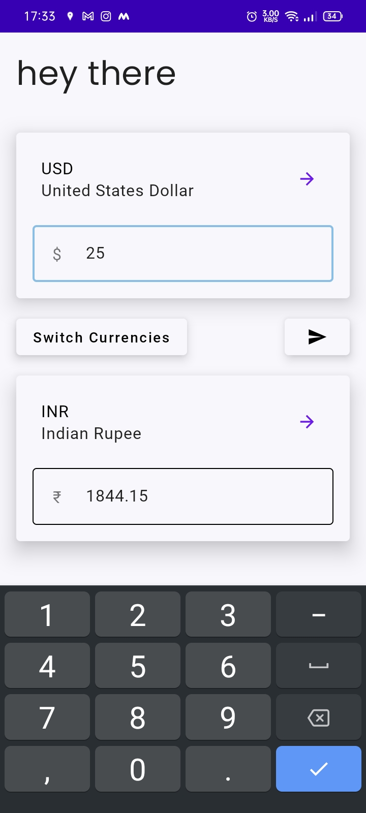
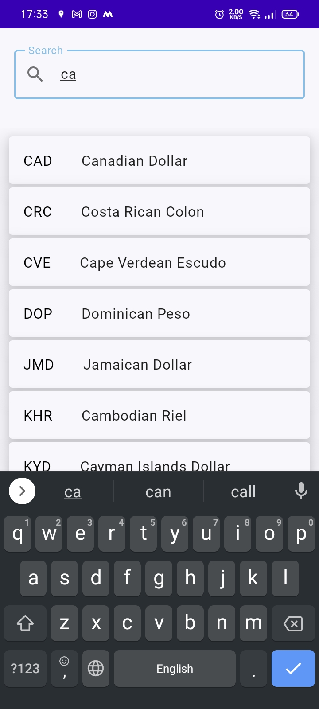
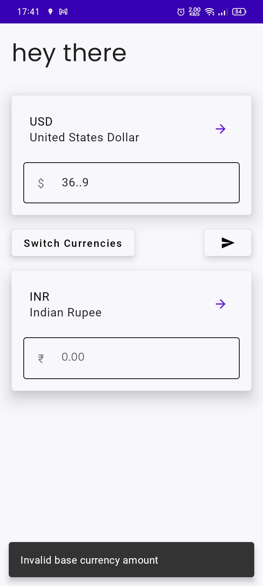

<h1 align="center">Currency Converter</h1>

A simple currency converter app

I created this app to teach myself Architecture, Network Requests (using ktor), State Flow and other concurrency stuff. 

> **_NOTE_** I have decided to use interface instead of backing field in my view model 

## Screenshots

 &nbsp;
 &nbsp;

## Built With

- Android Studio
- Kotlin
- Jetpack Compose
- [ExchangeRate-API](https://www.exchangerate-api.com/)
- [Ktor](https://ktor.io/)

## Author

**Hardik Sachan**

- [Github](https://github.com/hardiksachan)
- [LinkedIn](https://www.linkedin.com/in/hardik-sachan/)
- [Twitter](https://twitter.com/simplyHardikk)

## 🤝 Support

Give a ⭐️ if you like this project!